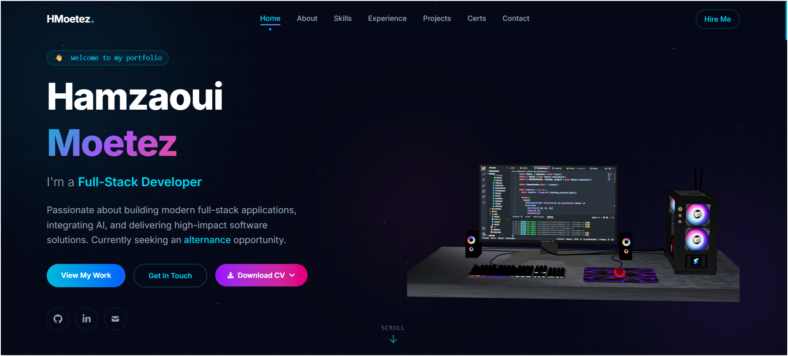
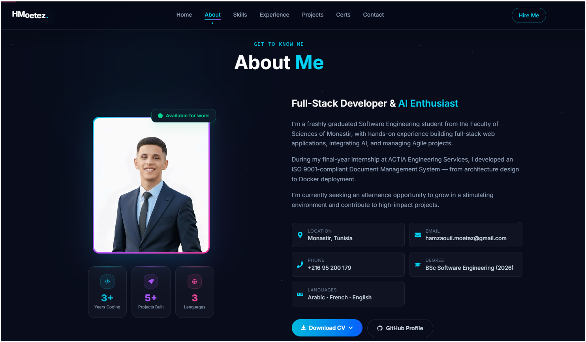

# Hamzaoui Moetez — Portfolio

Personal portfolio website built with React, Vite, Three.js and Tailwind CSS.

## Screenshots





## Tech Stack

- **Frontend:** React.js, Tailwind CSS, Three.js / React Three Fiber
- **Build:** Vite
- **Backend:** Node.js, Express.js (contact form)
- **Deployment:** Docker-ready

## Features

- Interactive 3D desktop PC model in the hero section
- Animated stars background
- Sections: About, Skills, Experience, Projects, Certifications, Contact
- Downloadable CV (EN / FR)
- Contact form with email delivery via Nodemailer

## Getting Started

```bash
npm install
npm run dev
```

To run the contact form backend:

```bash
cd server
node index.js
```

Create a `.env` file at the root with:

```
GMAIL_USER=your@gmail.com
GMAIL_APP_PASSWORD=your_app_password
SERVER_PORT=5000
VITE_API_URL=http://localhost:5000
```

## Contact

- Email: hamzaouii.moetez@gmail.com
- LinkedIn: [linkedin.com/in/hamzaoui-moetez](https://linkedin.com/in/hamzaoui-moetez)
- GitHub: [github.com/HMotez](https://github.com/HMotez)
