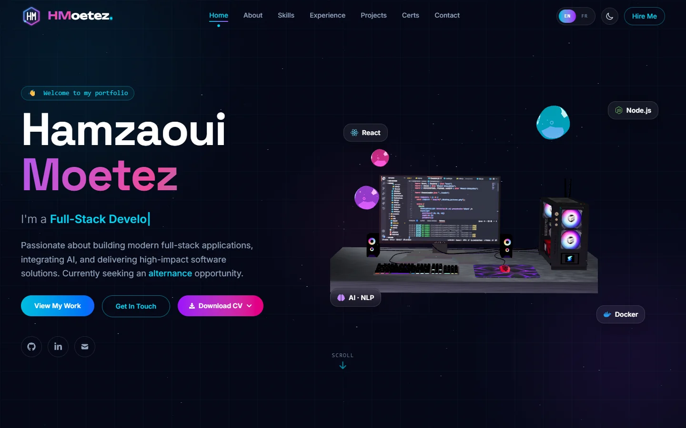
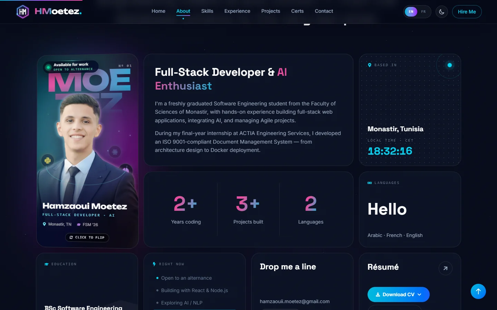
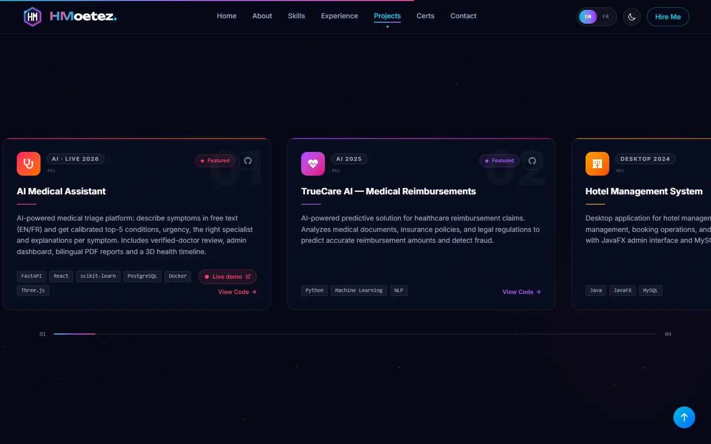
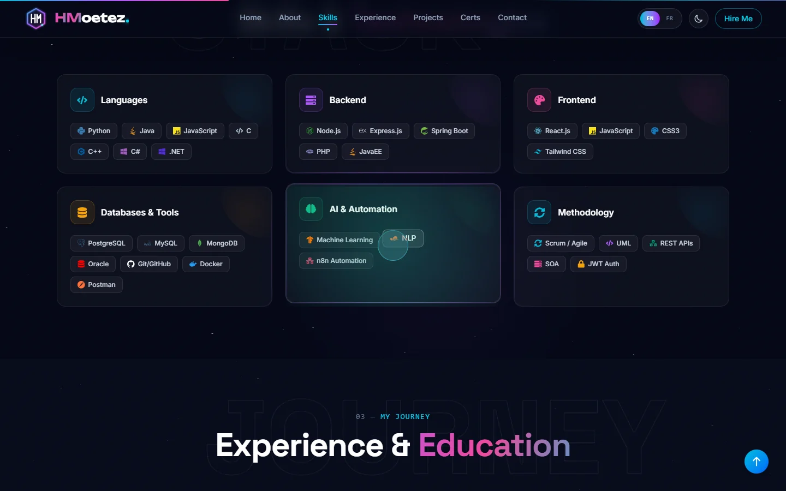
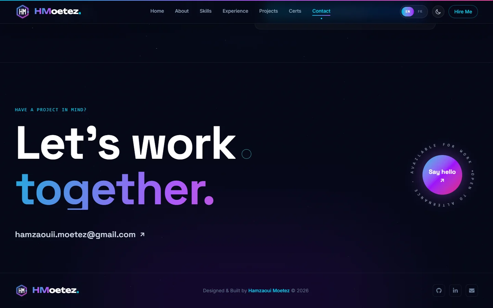
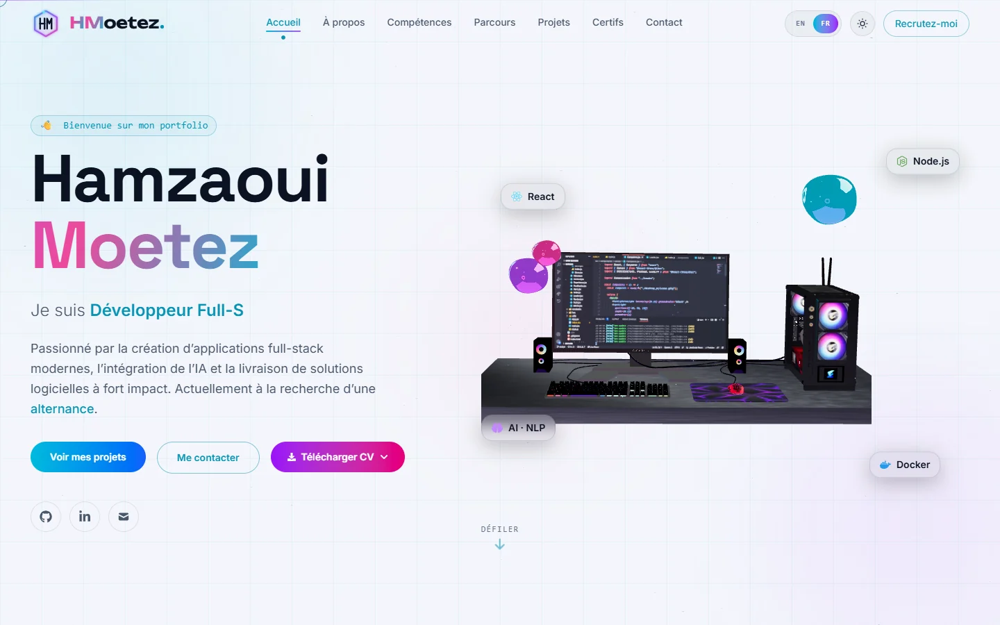
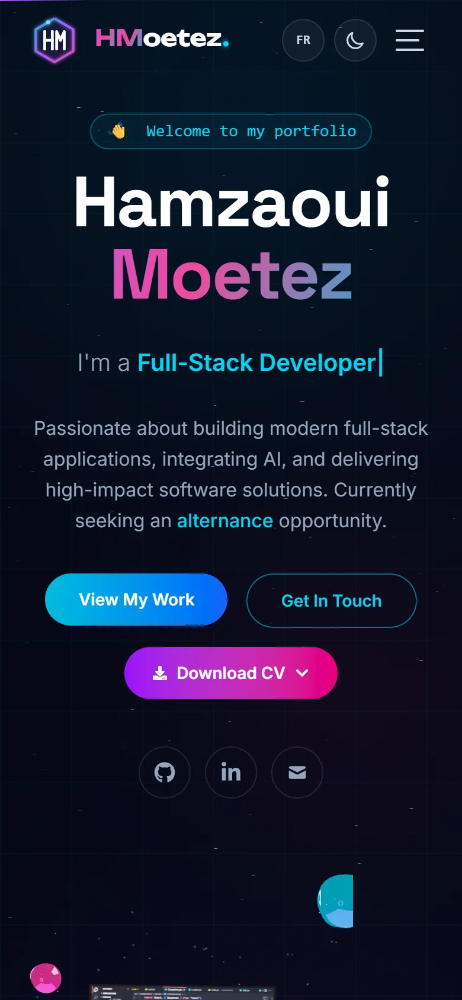

<div align="center">

# Hamzaoui Moetez — Portfolio

**Full-Stack Developer & AI enthusiast. A motion-design portfolio with real-time 3D,
built with React, Three.js and Framer Motion, in English and French, dark and light.**


**[🌐 Live → portfolio-hmotez.onrender.com](https://portfolio-hmotez.onrender.com)**  
<sub>Free hosting: the contact form's API can take about 50 seconds to wake up after a quiet period.</sub>



</div>

## Contents

- [Screenshots](#screenshots)
- [Features](#features)
- [Projects showcased](#projects-showcased)
- [Tech stack](#tech-stack)
- [Getting started](#getting-started)
- [Run with Docker](#run-with-docker)
- [Deployment](#deployment)
- [Project structure](#project-structure)
- [Contact](#contact)

## Screenshots

<table>
  <tr>
    <td width="50%"><br /><sub><b>About</b>: holographic 3D portrait card, live local time, bento grid</sub></td>
    <td width="50%"><br /><sub><b>Projects</b>: pinned horizontal showcase, live demo links</sub></td>
  </tr>
  <tr>
    <td><br /><sub><b>Skills</b>: tilt cards with a border glow that follows the cursor</sub></td>
    <td><br /><sub><b>Footer</b>: kinetic call to action with a magnetic button</sub></td>
  </tr>
  <tr>
    <td><br /><sub><b>Light theme, in French</b>: every string and project is translated</sub></td>
    <td align="center"><br /><sub><b>Mobile</b>: fully responsive</sub></td>
  </tr>
</table>

## Features

**Motion design**
- Intro preloader with an animated **HM logo** that draws itself, then a curtain reveal
- Inertia **smooth scrolling** (Lenis), custom cursor, magnetic buttons
- **Kinetic typography**: letter-by-letter hero name, word-by-word section titles, a scroll-lit statement
- Scroll-velocity **marquee**, a **timeline that draws itself** on scroll, a pinned **horizontal projects** showcase
- Count-up stats, flip-clock local time, cycling greetings (Hello · Bonjour · مرحبا)

**3D**
- Interactive **3D desk** (React Three Fiber) with glossy liquid blobs lit by a locally generated environment
- Floating glass tech badges that drift with the mouse at different depths
- **Holographic portrait card**: pointer tilt, six parallax layers, studio rim light, a perspective grid
  floor, tech logos orbiting behind and in front of the portrait, holographic foil and glare,
  and a 3D flip to an illustrated avatar

**Experience**
- **English / French** for the whole interface and all content, remembered per visitor
- **Dark / light** themes with a circular reveal transition (View Transitions API)
- Spotlight-border cards, downloadable CV (EN / FR), reduced-motion support
- **Contact form** that emails me: HTML-escaped input, validation, per-visitor rate limit

## Projects showcased

| Project | Stack | Links |
|---|---|---|
| **AI Medical Assistant** — AI triage: symptoms in free text (EN/FR) → calibrated top-5 conditions, urgency, specialist, verified-doctor review | FastAPI, React, scikit-learn, PostgreSQL, Docker | [Live demo](https://medai-hmotez.onrender.com) · [Code](https://github.com/HMotez/AI-Medical-Assistant) |
| **TrueCare AI** — medical reimbursement prediction and fraud detection | Python, Machine Learning, NLP | [Code](https://github.com/HMotez/MedClaimML) |
| **Hotel Management System** — desktop app for staff, rooms and bookings | Java, JavaFX, MySQL | [Code](https://github.com/HMotez/HotelSystem) |
| **University SOA System** — REST + SOAP services with JWT | Spring Boot, Java, Docker | [Code](https://github.com/HMotez/University-SOA) |

## Tech stack

| Layer | Stack |
|---|---|
| Frontend | React 19, Vite 8, Tailwind CSS 4, Framer Motion, Lenis, react-icons |
| 3D | Three.js, React Three Fiber, drei |
| Backend | Node.js, Express 5 (contact API) — Gmail SMTP locally, [Resend](https://resend.com) in production |
| Delivery | Docker Compose (nginx serving the build + API), Render (static site + Docker web service) |

## Getting started

```bash
npm install
cp .env.example .env    # set GMAIL_USER and GMAIL_APP_PASSWORD (a Google app password)
npm run dev             # website on http://localhost:5173 + contact API on :5000
```

| Command | What it does |
|---|---|
| `npm run dev` | Website (Vite) and contact API together |
| `npm run build` | Production build into `dist/` |
| `npm run preview` | Serve the production build locally |
| `npm run lint` | ESLint |
| `node server/test.js` | Send yourself a test email with the `.env` settings |

## Run with Docker

```bash
cp .env.example .env    # set GMAIL_USER and GMAIL_APP_PASSWORD
docker compose up --build
```

Open <http://localhost:3000>. nginx serves the website and forwards `/api` to the API container.
Stop with `docker compose down`.

## Deployment

Live on **Render** (free): the website as a static site and the contact API as a Docker web
service, auto-deployed on every push to `main`. Render's free plan blocks outbound SMTP, so in
production the API sends mail through Resend's HTTP API. Step-by-step guide: **[DEPLOY.md](DEPLOY.md)**.

## Project structure

```
├── docker/
│   ├── Dockerfile.frontend    # Vite build → nginx
│   ├── Dockerfile.backend     # Express contact API (only its own dependencies)
│   └── nginx.conf             # SPA routing, caching, /api proxy
├── public/                    # CVs, 3D model, portrait, avatar, favicon
├── server/                    # contact API (Express)
├── src/
│   ├── components/            # page sections (Hero, About, Projects, …)
│   │   └── fx/                # motion & 3D building blocks (HoloPortrait, Logo, Marquee, …)
│   ├── data/portfolio.js      # content: bio, skills, experience, projects (EN/FR)
│   └── i18n/                  # interface strings (EN/FR) and language provider
├── docker-compose.yml
├── render.yaml                # Render Blueprint
└── DEPLOY.md
```

To change the content (projects, experience, bio), edit [`src/data/portfolio.js`](src/data/portfolio.js);
interface text lives in [`src/i18n/strings.js`](src/i18n/strings.js).

## Contact

- Email: hamzaouii.moetez@gmail.com
- LinkedIn: [linkedin.com/in/hamzaoui-moetez](https://linkedin.com/in/hamzaoui-moetez)
- GitHub: [github.com/HMotez](https://github.com/HMotez)
